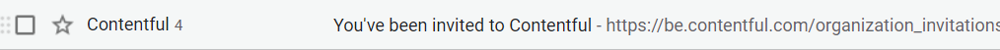
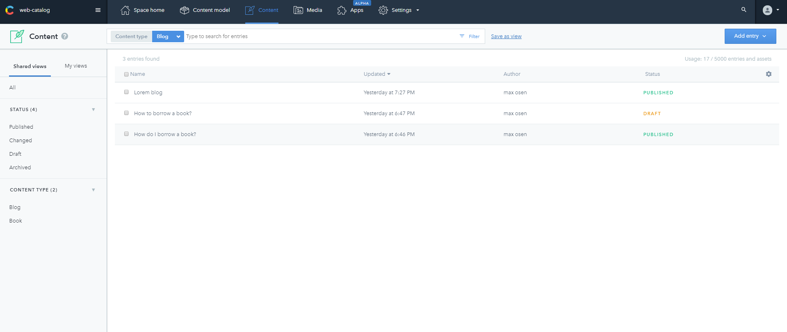
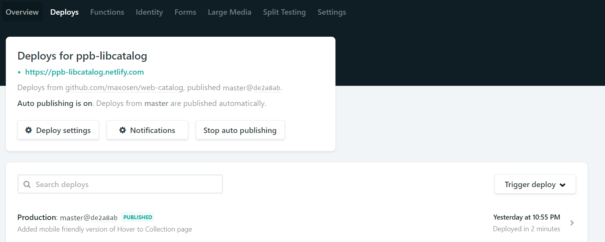

# How to add new books to web library catalog

## Steps

### Step 1: Accept admin invitation and sign up for Contentful

### Step 2: Add new book entries

  1. After logging into Contentful
  2. Navigate to `Content` tab
  3. Click on the **blue** `Add entry` button to add new books' information
  4. Fill in all the details of the book and click on **green** `publish` button

### Step 3: Redeploy your website

  1. After adding new data, go to `Netlify.com`
  2. Log in to your account
  3. Click on `Trigger Deploy` button to deploy your website with new published data

